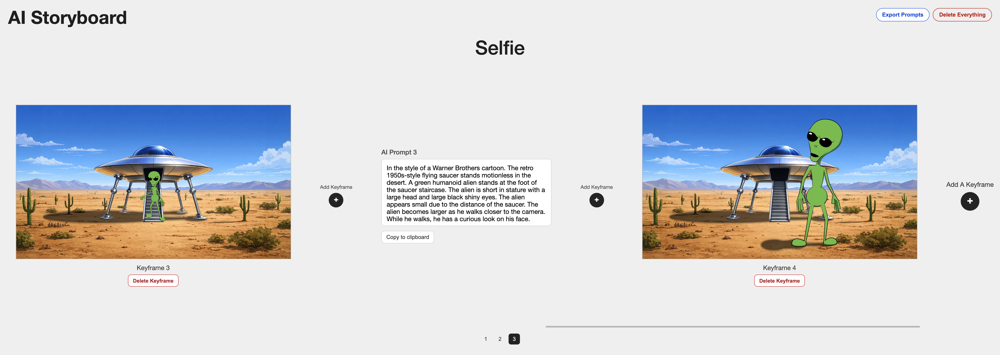

# AI Storyboard

AI Storyboard is a framework-free single-page web app for planning AI-generated video prompts.
It lets you add keyframe images, then write prompt text to describe the video that should be generated between each pair of keyframes.

All project data is stored only in your current browser using `localStorage` and the Cache API.
There is no backend server storing storyboard data, projects are not transferable between computers by default, and clearing browser cache/storage will erase all saved keyframes and prompts.



## Tech Stack
- HTML, CSS, and modular JavaScript only
- No framework, no build step, no external runtime dependencies
- Browser-only state and asset persistence (`localStorage` + Cache API)

## Local Development Setup
1. Clone the repo and enter the project directory.
2. Start a static server from the project root.

Example options:

```bash
# Python 3
python3 -m http.server 8000
```

```bash
# Node (if you prefer)
npx serve .
```

3. Open `http://localhost:8000` (or the URL printed by your server).

Notes:
- Do not open `index.html` directly via `file://`; Cache API behavior is browser/server-context dependent.
- No install step is required unless you choose an npm-based static server.

## Project Structure
```text
.
├── index.html
├── styles.css
├── js/
│   ├── main.js
│   ├── app.js
│   ├── config.js
│   ├── state-manager.js
│   ├── storage-manager.js
│   ├── image-manager.js
│   └── ui-renderer.js
├── designs/
├── AGENTS.md
└── README.md
```

## Architecture Overview
- `App` (`js/app.js`)
  - Bootstraps app modules and binds UI interactions.
  - Handles title edit mode, prompt focus/centering, keyframe insertion/deletion, and export/reset flows.

- `StateManager` (`js/state-manager.js`)
  - Owns canonical in-memory app state.
  - Applies state mutations and enforces ordering rules (`prompts = keyframes - 1`).
  - Triggers immediate persisted writes (debounced for text input).

- `StorageManager` (`js/storage-manager.js`)
  - Serializes/deserializes JSON state in `localStorage`.

- `ImageManager` (`js/image-manager.js`)
  - Validates uploads, writes/reads image blobs in Cache API, clears cache on reset.

- `UIRenderer` (`js/ui-renderer.js`)
  - Renders the entire UI from state and exposes event hooks back to `App`.

## Current Behavior
- Top-left app title: `AI Storyboard`
- Top-right controls: `Export Prompts` and `Delete Everything`
- Centered project title that toggles to editable mode on click
- Horizontally scrollable storyboard rail
- Add keyframes via image upload at the end or at insertion controls on both sides of each prompt
- Auto-maintain alternating sequence: keyframe/prompt/keyframe/prompt
- Prompt labels are numbered (`AI Prompt 1`, `AI Prompt 2`, ...)
- Each prompt includes a `Copy to clipboard` action with temporary `Copied` feedback
- Each keyframe includes `Delete Keyframe` with confirmation and prompt reconciliation behavior
- Fixed-center pagination shown when prompt tiles exist
- Wheel input over the rail maps to horizontal scrolling (except inside overflowed prompt textareas)
- Rail re-renders preserve prompt context by re-centering on the currently centered prompt
- Missing cached image restores as an in-sequence placeholder tile

## Export Behavior
- `Export Prompts` downloads a `.txt` file generated entirely in the browser.
- Prompts are concatenated in storyboard order.
- Each section starts with a hard return, heading (`AI Prompt #`), another hard return, prompt text, and a trailing hard return for spacing.

## Persistence Model
- State JSON is stored in `localStorage` under a configured key.
- Image binary data is stored in Cache API under a configured cache name.
- Text input writes are debounced (see `SAVE_DEBOUNCE_MS` in `js/config.js`).
- Non-text structural changes (uploads, selection changes, reset) persist immediately.

## Reset Behavior
`Delete Everything` clears:
- App state entry from `localStorage`
- Cached storyboard images from Cache API

After reset, the app returns to the empty initial state.

## Development Notes
- Keep modules framework-free and browser-native.
- Keep render order deterministic: keyframe/prompt/keyframe/.../add-button.
- Prefer stable IDs in state to support future reordering/deletion features.
